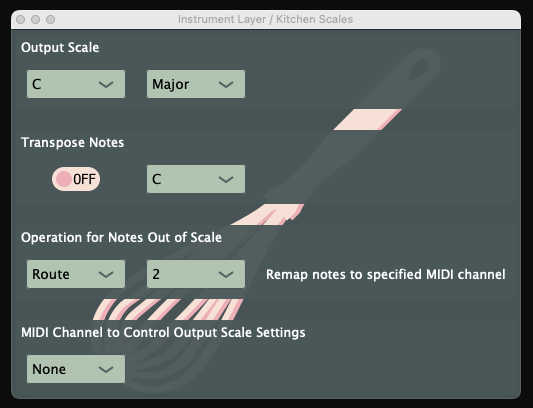

# Kitchen Scales VST

Wrangle your MIDI data into a variety of scales in creative ways! This project is built with [JUCE](https://juce.com/get-juce).

## The Output Scale
No matter what notes you are sending from a keyboard or other MIDI source, the output from this VST will always be in the scale that you select here! Supported scales at this time are:
- Major and Minor scales
- Harmonic Minor
- Dorian
- Blues Major and Minor
- Whole Tone
- Major and Minor Pentatonic
- Super Locrian

## Transpose Notes
Have a composition already within a certain key? Select the key here for it to be transposed to the key selected in the Output Scale.

## Operation for Notes Out of Scale
So you play a note that is not within the selected scale - here is where you decide how you want Kitchen Scales to handle it.
- **Drop**: Filter out the notes that are not in scale.
- **Up**: Transpose the note up to the nearest note in scale.
- **Down**: Transpose the note down to the nearest note in scale.
- **Random**: Randomly choose for each note to transpose up or down to the next note in scale.
- **Route**: Remap the MIDI channel of the note to some other MIDI channel.
- **None**: Do nothing and allow the note through.

## MIDI Channel to Control Output Scale Settings
The MIDI channel selected here will control which key is used in the Output Scale. For example, if a C# key is sent over this control channel, the Output Scale's key will be set to C#. This allows for some fun performance tricks for on-the-fly key changes!

## Compiling
Open the Sclaes.jucer project file with JUCE's [Projucer](https://docs.juce.com/master/tutorial_new_projucer_project.html) manager. From there you can generate a project template for your IDE of choice. I have tested this on XCode and Visual Studio.
